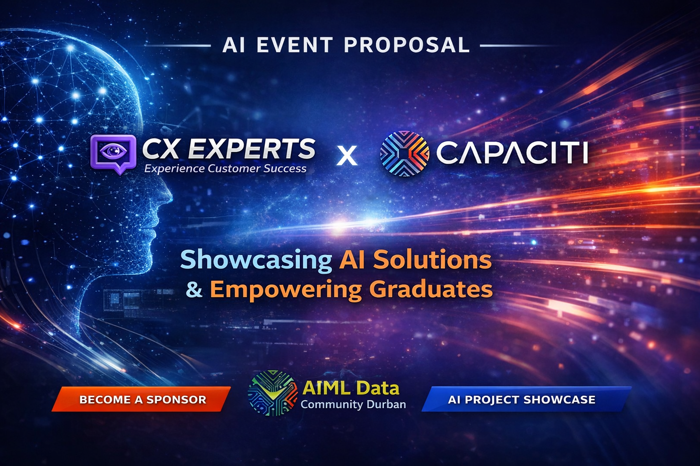
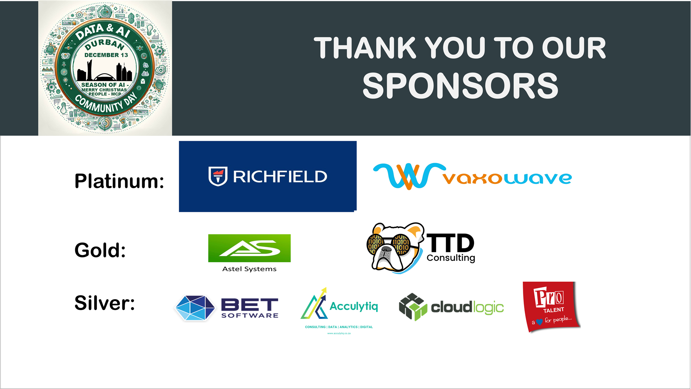
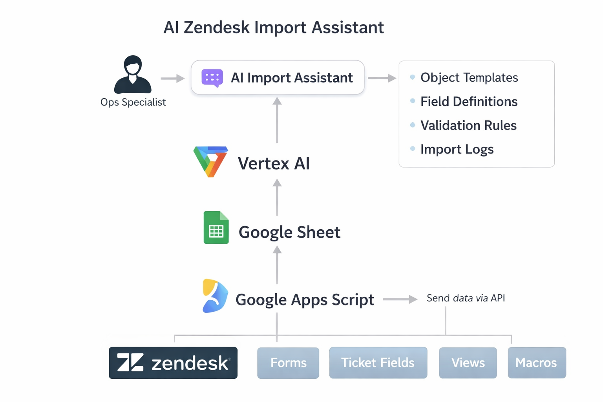
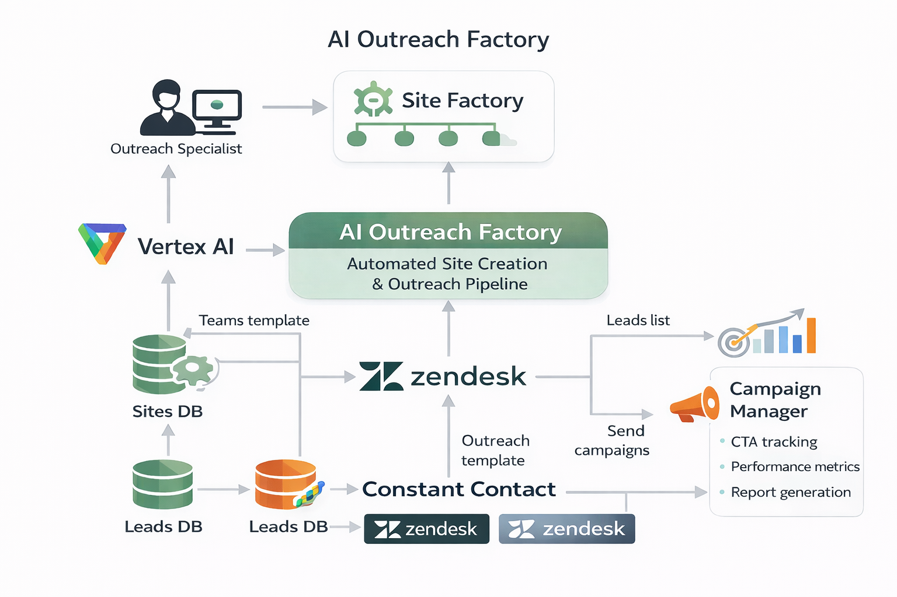
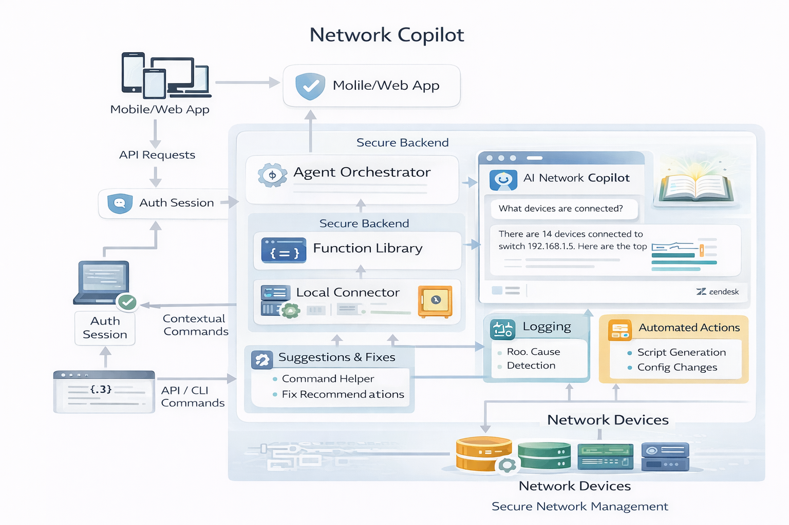
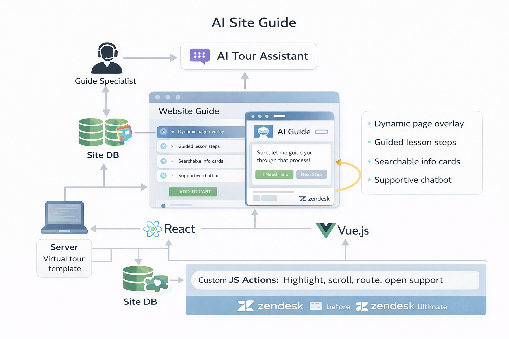
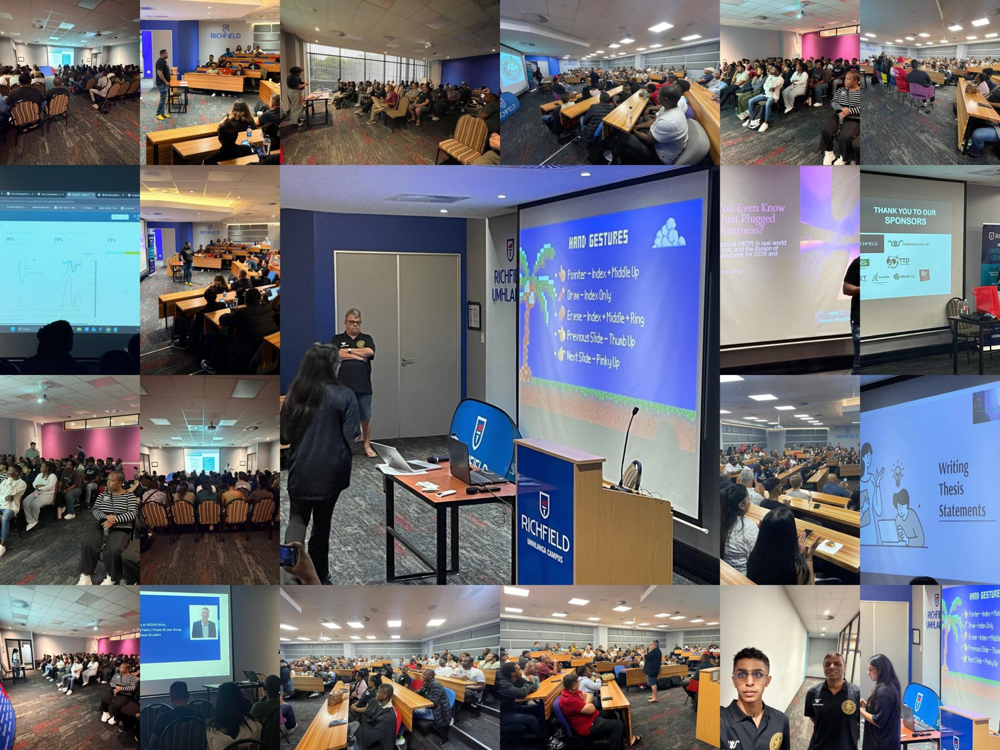
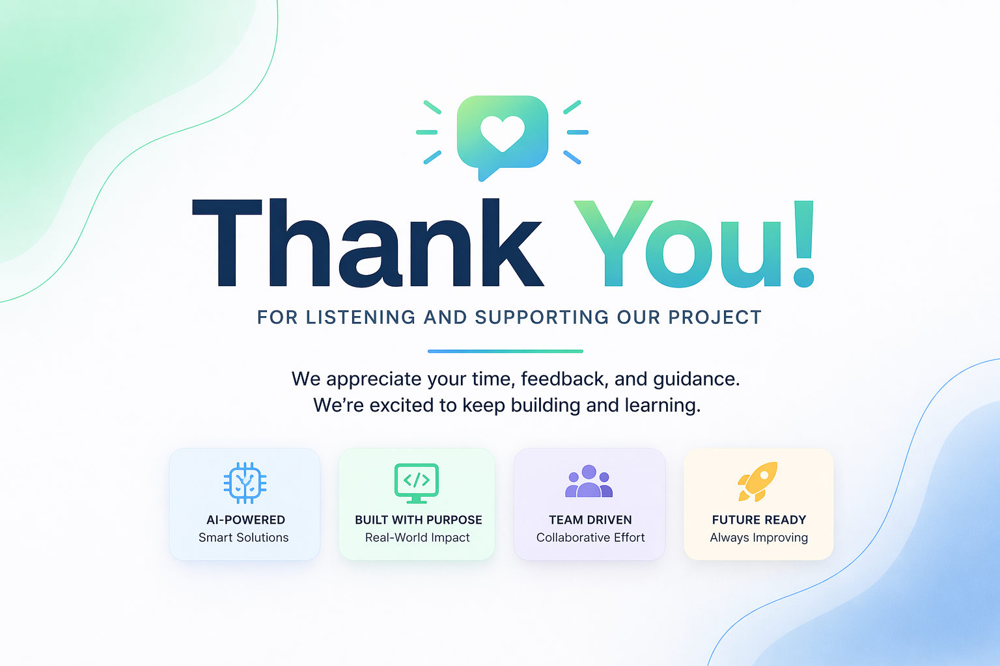

# WEBSITE SECTION 1 — HERO

## CX Experts x Capaciti
### AI Event Proposal

A focused proposal to position **CX Experts** and **Capaciti** at an AI event through sponsorship, brand presence, and a practical AI project showcase.

---

# WEBSITE SECTION 2 — ABOUT THE PROPOSAL

## What this proposal is

The proposal is to use the event as a platform to:
- showcase practical AI concepts
- give graduates a public demo opportunity
- position **Capaciti** as a skills and talent partner
- position **CX Experts** as a technical implementation partner
- create visibility through branding, presentations, and event presence

The discussion supports a **3-project main showcase**, with the **bot concept kept as an optional extra** if leadership is interested.

---

# WEBSITE SECTION 3 — ABOUT THE EVENT OPPORTUNITY

## What the event opportunity means in this proposal

The event is being treated as a space to:
- present practical AI work
- show graduate capability in a public setting
- create visibility for both organizations
- support partner branding through presentations, banners, and a stand or table presence

It is also an opportunity to request a dedicated showcase session so the projects can be presented one after the other.

---

# WEBSITE SECTION 4 — WHY CX EXPERTS AND CAPACITI SHOULD PARTICIPATE

## Benefit to Capaciti
- public graduate exposure
- proof that learners can build practical solutions
- stronger credibility through visible project work
- a stronger skills-development success story

## Benefit to CX Experts
- visible technical brand presence
- an opportunity to show practical AI and automation ideas
- a chance to test concepts that may later be reused or resold
- stronger positioning in front of an event audience

## Shared benefit
- co-branded visibility
- stronger partner presence
- presentation and marketing content
- proof of collaboration between skills development and implementation

---

# WEBSITE SECTION 5 — SPONSORSHIP AND MARKETING OPPORTUNITY

## Sponsorship and presence

The discussion supports the idea that **CX Experts** and **Capaciti** could participate as sponsors or visible partners.

### What can be requested
- banner placement
- a desk, table, or stall
- branded presence during presentations
- a session to showcase the projects one after another
- permission to capture content for marketing

### Marketing value
- co-branded presentation slides
- merged logo assets
- banners at the stand
- LinkedIn content before, during, and after the event
- post-event proof of graduate capability and collaboration

---

# WEBSITE SECTION 6 — MAIN PROJECT SHOWCASE

## Recommended main set
1. **AI Zendesk Import Assistant**
2. **AI Site Factory & Outreach Pipeline**
3. **AI Network Copilot**

## Optional extra
4. **AI Site Guide**

## Why only 3 as the main set
- keeps the showcase focused
- reduces delivery risk
- makes the demos easier to finish and present well
- still leaves room to mention the 4th concept if leadership wants more

---

# WEBSITE SECTION 7 — PROJECT CARDS

## Project card 1
### AI Zendesk Import Assistant
An AI-assisted setup tool where a user describes what they want, the system structures the data, and the configuration is pushed into Zendesk.

## Project card 2
### AI Site Factory & Outreach Pipeline
An AI workflow that takes business data, generates a website concept, prepares an outreach email, and supports a publish flow.

## Project card 3
### AI Network Copilot
An AI support concept that can interact with a switch or local environment and return useful network or device information.

## Optional project card
### AI Site Guide
An AI-led site or help-center guide that interprets what the user wants and sends them to the right page, step, or support path.

---

# WEBSITE SECTION 8 — EXPANDED PROJECT DETAILS

## AI Zendesk Import Assistant
**What it does**  
A user describes what should be built in Zendesk. The AI converts that into structured data or templates, and the system pushes the configuration into the instance.

**Simple process flow**
- user enters the requirement
- AI structures the request into the required format
- the template or sheet is prepared
- configuration is pushed into Zendesk

**Light tech direction**
- Zendesk
- Apps Script
- spreadsheet/template layer
- AI model or agent layer

---

## AI Site Factory & Outreach Pipeline
**What it does**  
Business data is collected and cleaned, then used to generate a site concept and an outreach message through an AI-assisted workflow.

**Simple process flow**
- business data is collected
- data is cleaned and structured
- AI generates website content
- AI drafts the outreach email
- a publish or send decision is made

**Light tech direction**
- data source or scraping input
- spreadsheet cleanup layer
- AI model or agent layer
- website template and publish flow
- email output

---

## AI Network Copilot
**What it does**  
A user asks a technical question about connected devices or network status. The AI agent returns the relevant information through a guided interface.

**Simple process flow**
- user asks for a network check
- AI interprets the request
- the system checks the switch or device data
- the result is returned in plain language

**Light tech direction**
- local or lab network environment
- device or switch access
- AI agent layer
- guided interface

---

## AI Site Guide *(Optional)*
**What it does**  
A user asks for help in plain language. The AI interprets the request and guides the person to the correct page, link, or support path.

**Simple process flow**
- user asks for help
- AI interprets the intent
- system selects the relevant page or next step
- user is guided through the site experience

**Light tech direction**
- website or help-center layer
- AI intent layer
- page or route guidance logic

---

# WEBSITE SECTION 9 — DELIVERY MODEL

## Team shape
- around **3 to 4 people per project**
- presenters can be split across the teams
- support can be given during demos if difficult questions come up

## Timing
- the discussion suggests a **tight timeline**, roughly **2 months**
- this is why the proposal should stay focused and realistic

## Tooling direction raised in the discussion
- AI agent or LLM access may be needed
- **Vertex** was raised as a possible option
- paid tooling may be needed for the first month or two if required for proof of concept

---

# WEBSITE SECTION 10 — PRESENTATION AND SHOWCASE FORMAT

## Suggested presentation flow
- brief introduction to the collaboration
- why the showcase matters
- project 1 demo
- project 2 demo
- project 3 demo
- optional mention of the AI Site Guide concept
- close with the graduate and innovation story

## Event-day setup
- branded banners
- co-branded slides
- a stall or desk area
- one showcase session with demos presented one after the other
- content captured for later marketing use

---

# WEBSITE SECTION 11 — CLOSING MESSAGE

## Closing

This proposal is built around a simple idea:

**Capaciti can showcase graduate capability, and CX Experts can help turn that capability into practical, demo-ready AI solutions.**

A focused 3-project showcase, with sponsorship and visible branding, gives both organizations a strong way to participate while keeping delivery realistic.

---

# WEBSITE SECTION 12 — THANK YOU / NEXT STEP

## Thank you

Thank you for considering this proposal.

### Next step if approved
- confirm the 3 main projects
- confirm whether the optional bot concept should also be included
- confirm sponsorship or partner visibility
- align the presentation format
- assign teams and begin building the proofs of concept

